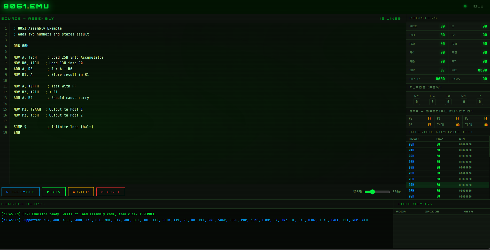

# 🖥️ 8051 Emulator — Web-Based Assembly Simulator

A fully functional **Intel 8051 microcontroller emulator** that runs entirely in the browser — no installation, no dependencies. Write, assemble, and execute 8051 assembly code with real-time register, flag, and memory visualization.

\---

## ✨ Features

* **Built-in Code Editor** with line numbers and syntax-friendly layout
* **Assembler** — parses and assembles 8051 mnemonics directly in the browser
* **Step-by-step execution** — execute one instruction at a time for debugging
* **Run mode** with adjustable speed slider (50ms – 1000ms per instruction)
* **Live Register View** — ACC, B, R0–R7, SP, PC, DPTR, PSW with change highlighting
* **PSW Flags Panel** — CY, AC, F0, OV, P with visual ON/OFF indicators
* **SFR Panel** — P0, P1, P2, P3, TMOD, TCON special function registers
* **Internal RAM table** — 00H–1FH with HEX + Binary display
* **Code Memory table** — assembled instructions with current PC highlighted
* **Console Output** — timestamped log of every executed instruction
* **Green-on-black retro terminal aesthetic** with scanline overlay and glow effects

\---

## 🚀 Getting Started

### Option 1 — Open directly in browser

Just download the file and open it:

```bash
git clone https://github.com/moltate/8051-emulator.git
cd 8051-emulator
# Open 8051\_emulator.html in any browser
```

No server, no build step, no dependencies required.

### Option 2 — Serve locally (optional)

```bash
# Using Python
python -m http.server 8080

# Using Node.js
npx serve .
```

Then open `http://localhost:8080/8051\_emulator.html` in your browser.

\---

## 📖 How to Use

1. **Write** your 8051 assembly code in the editor (a sample program is preloaded)
2. Click **⚙ ASSEMBLE** to parse and compile the code
3. Click **▶ RUN** to execute the full program (click again to pause)
4. Click **⏭ STEP** to execute one instruction at a time
5. Use the **SPEED** slider to control execution delay
6. Click **↺ RESET** to clear all registers and start fresh
7. Watch registers, flags, and memory update in real time

\---

## 🔧 Supported Instructions

|Category|Instructions|
|-|-|
|**Data Transfer**|`MOV`, `XCH`, `PUSH`, `POP`|
|**Arithmetic**|`ADD`, `ADDC`, `SUBB`, `INC`, `DEC`, `MUL`, `DIV`|
|**Logic**|`ANL`, `ORL`, `XRL`, `CLR`, `SETB`, `CPL`|
|**Rotate / Shift**|`RL`, `RR`, `RLC`, `RRC`, `SWAP`|
|**Jump**|`SJMP`, `LJMP`, `AJMP`, `JMP`, `JZ`, `JNZ`, `JC`, `JNC`, `DJNZ`, `CJNE`|
|**Subroutine**|`CALL`, `LCALL`, `ACALL`, `RET`|
|**Misc**|`NOP`|

### Addressing Modes Supported

* **Immediate** — `MOV A, #25H`
* **Register** — `MOV R0, A`
* **Direct** — `MOV 30H, A`
* **SFR** — `MOV P1, #0FFH`
* **Label-based jumps** — `SJMP LOOP`, `DJNZ R2, LOOP`

\---

## 📝 Sample Programs

### Add Two Numbers

```asm
ORG 00H

MOV A, #25H     ; Load 25 into Accumulator
MOV R0, #13H    ; Load 13 into R0
ADD A, R0       ; A = A + R0 = 38H
MOV R1, A       ; Store result in R1

SJMP $          ; Halt
END
```

### Counting Loop

```asm
ORG 00H

MOV R2, #0AH    ; Counter = 10
MOV A, #00H     ; Clear accumulator

LOOP:
    INC A           ; Increment A
    DJNZ R2, LOOP  ; Repeat until R2 = 0

MOV R3, A       ; Store final value
SJMP $
END
```

### Multiply Two Numbers

```asm
ORG 00H

MOV A, #0CH     ; A = 12
MOV B, #05H     ; B = 5
MUL AB          ; A = low byte, B = high byte

SJMP $
END
```

### Output to Port

```asm
ORG 00H

MOV P1, #0AAH   ; Output 10101010 to Port 1
MOV P2, #55H    ; Output 01010101 to Port 2

SJMP $
END
```

\---

## 📁 Project Structure

```
8051-emulator/
│
├── 8051\_emulator.html    # Complete emulator (single file, self-contained)
├── README.md             # This file
└── screenshot.png        # (optional) UI screenshot
```

> The entire emulator — assembler, CPU core, UI — is contained in a single HTML file with no external dependencies.

\---

## 🏗️ Architecture

The emulator is built in pure vanilla JavaScript:

* **Assembler** — two-pass: first pass collects labels, second pass builds instruction list
* **CPU Core** — models ACC, B, R0–R7, SP, PC, DPTR, PSW registers; internal RAM (256 bytes); SFR map
* **Execution Engine** — switch-case dispatcher for each mnemonic with flag updates (CY, AC, OV, P)
* **UI Layer** — DOM-based register display with change animation; RAM and code memory tables

\---

## ⚠️ Limitations

* No external RAM (XRAM) support
* No timer/interrupt simulation
* No serial communication (UART/SBUF)
* Indirect addressing (`@R0`, `@R1`) partially supported
* No bit-addressable memory operations beyond CY flag
* Code memory is instruction-list based (not byte-addressable)

These are planned for future versions.

\---

## 🔮 Roadmap

* \[ ] Indirect addressing `@R0`, `@R1`, `@DPTR`
* \[ ] Bit-addressable RAM (20H–2FH)
* \[ ] Timer 0 / Timer 1 simulation
* \[ ] Interrupt support (INT0, INT1, Timer overflow)
* \[ ] Serial port (SBUF, SCON)
* \[ ] External RAM (MOVX instruction)
* \[ ] Breakpoints
* \[ ] Program load from `.hex` / `.asm` file
* \[ ] Export register snapshot

\---

## 🤝 Contributing

Contributions are welcome! To contribute:

1. Fork the repository
2. Create a feature branch: `git checkout -b feature/add-timer-support`
3. Commit your changes: `git commit -m "Add Timer 0/1 simulation"`
4. Push to the branch: `git push origin feature/add-timer-support`
5. Open a Pull Request

\---

## 📄 License

This project is open source and available under the [MIT License](LICENSE).

\---

## Acknowledgements

* Intel 8051 Architecture Reference Manual
* MCS-51 Programmer's Guide and Instruction Set

\---

